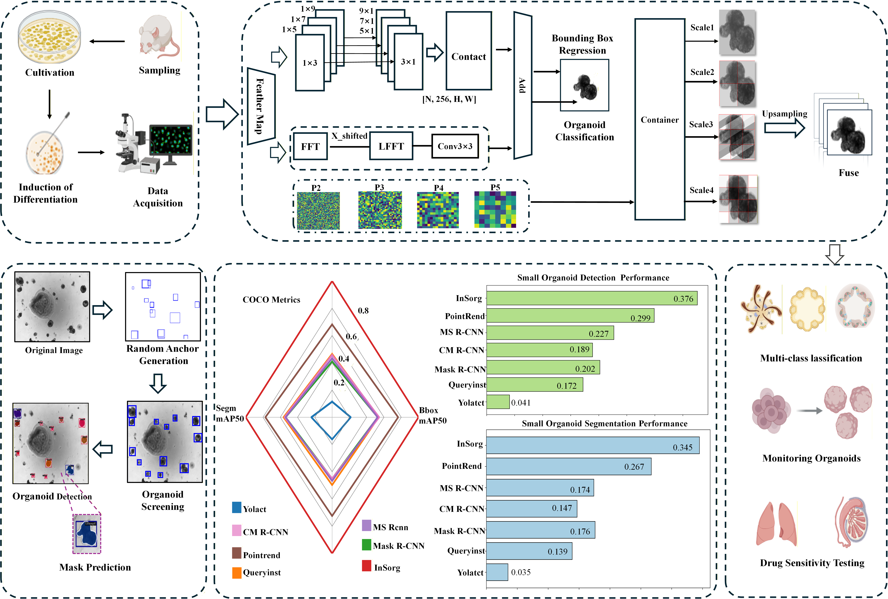
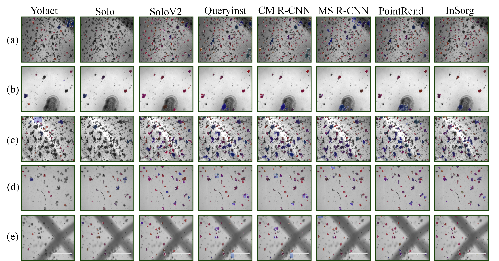

# InSorg: An Instance Segmentation Method Tailored for Irregular Shapes and Small-Scale Organoids


## 📝Introduction

InSorg is an intelligent organoid image analysis platform integrated with state-of-the-art computer vision and deep learning techniques. It enables high-throughput segmentation, detection, and quantitative analysis of brightfield organoid images, automatically extracts key biological metrics, supports multi-modal image inputs, and thus significantly improves the efficiency of workflows in cancer research and personalized medicine.

<div align="center">
  
</div>

## 🧪Visualizations

<div align="center">
  
</div>

## 📦Getting Started


---

### • Environment Setup

```bash

# Environment and Dependency Installation Workflow (InSorg Project)
# 1. Create a conda virtual environment named InSorg_env with Python 3.8 (core runtime environment for the project)
conda create -n InSorg_env python=3.8
# 2. Activate the InSorg_env environment (all subsequent installations are executed in this isolated environment to avoid global dependency conflicts)
conda activate InSorg_env
# 3. Install the PyTorch framework (core dependency for deep learning computations; the latest compatible version for Python 3.8 will be installed if no specific version is specified)
pip3 install torch 
# 4. Install and upgrade the OpenMIM tool (package management tool for OpenMMLab projects, facilitating the installation of MM-series libraries)
pip install -U openmim
# 5. Install MMEngine via mim (MMEngine is the foundational runtime framework of OpenMMLab, providing universal engineering capabilities)
mim install mmengine 
# 6. Install MMCV (fundamental computer vision library of OpenMMLab, offering core CV operators and tools)
pip install mmcv
# 7. Batch install remaining project dependencies (requirements.txt is the custom dependency list of the project, including all packages not installed individually)
pip install -r requirements.txt
```


## ➡️Usage
The experimental validation was performed on a computing server equipped with NVIDIA A100 GPUs.
---
### • Dataset
The gastric and intestinal organoid dataset was randomly split into training, validation, and test subsets at a ratio of 8:1:1, with the detailed dataset structure presented as follows:
```bash
InSorg/
├── data/
│   ├── coco/                      # Root directory for COCO-format dataset
│   │   ├── train/                 # Training set images (aligned with original train set, following COCO naming conventions)
│   │   │   ├── train.image        # Training set image list file
│   │   ├── val/                   # Validation set images (aligned with original val set)
│   │   │   ├── val.image          # Validation set image list file
│   │   ├── test/                  # Test set images (aligned with original test set)
│   │   │   ├── test.iamge         # Test set image list file
│   │   ├── annotations/           # COCO-format annotation files (core: JSON files containing instance segmentation masks)
│   │   │   ├── instances_train.json  # Instance segmentation annotations for training set (replaces original label/train/)
│   │   │   ├── instances_val.json    # Instance segmentation annotations for validation set (replaces original label/val/)
│   │   │   └── instances_test.json   # Instance segmentation annotations for test set (optional, replaces original label/test/)
```

### • Training

```shell script
# Activate InSorg Conda environment
conda activate InSorg_env
# Enter InSorg project root directory
cd Insorg
# Launch model training on GPU 2 with InSorg.py configuration
CUDA_VISIBLE_DEVICES=2 python tools/train.py  InSorg/InSorg.py
```

### • Testing 

```shell script
# Run model test on GPU 2 with InSorg.py config; --weights specifies pre-trained model weights
CUDA_VISIBLE_DEVICES=2 python tools/test.py InSorg/InSorg.py -- weights
```


## ⚖️License

This project is released under the [Apache 2.0 license](LICENSE).


## 👍Acknowledgement

MMDetection is an open source project that is contributed by researchers and engineers from various colleges and companies. We appreciate all the contributors who implement their methods or add new features, as well as users who give valuable feedbacks.
We wish that the toolbox and benchmark could serve the growing research community by providing a flexible toolkit to reimplement existing methods and develop their own new detectors.


## 📃Citation

Please cite the following work if you use this codebase in your research.


